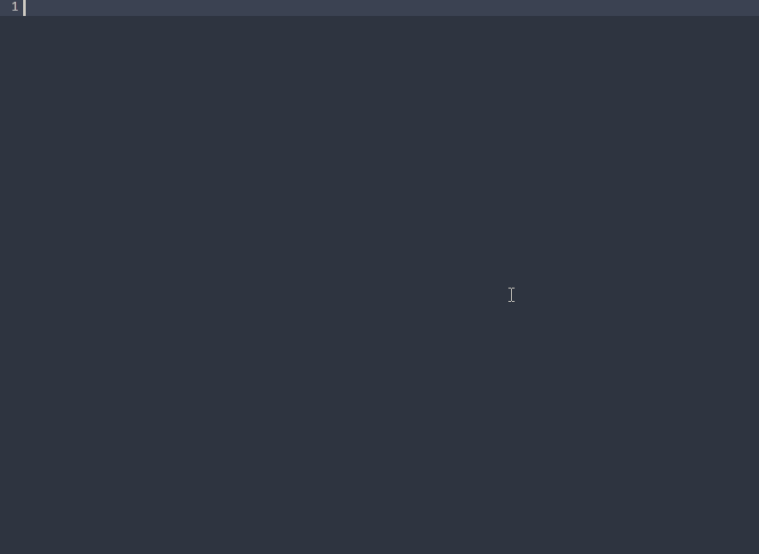
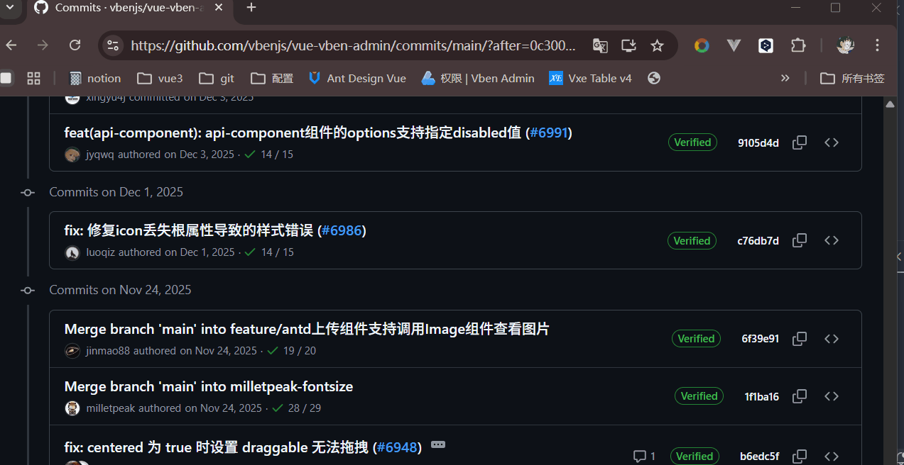
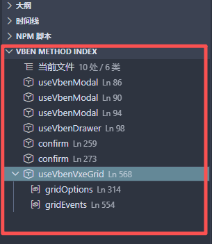

# Vben Admin Snippet

> Vue Vben Admin 工程辅助插件：智能补全、方法索引、上游 commit 安全同步。

> **默认会在 Vben 组件配置上下文里按 Enter 自动触发补全，可在配置中关闭。**

## 简介

- `智能片段与上下文补全`：输入 `vb-` 快速生成模板，在 Vben 调用上下文补全参数和 API。
- `Vben Method Index`：侧边栏展示当前文件里的 Vben 方法/API，点击即跳转。
- `上游 Commit 安全同步`：输入 `vbenjs/vue-vben-admin` 的 commit SHA 或 URL，仅在本地未改动时应用变更。





## 详细功能

### 1) 智能片段与上下文补全

- `vb-` 片段：`vb-alert`、`vb-confirm`、`vb-prompt`、`vb-modal`、`vb-drawer`、`vb-form`、`vb-vxe-table`、`vb-page`。
- 上下文补全：`useVbenForm`、`useVbenModal`、`useVbenDrawer`、`useVbenVxeGrid`、`alert`、`confirm`、`prompt`。
- API 补全：`modalApi.`、`drawerApi.`、`formApi.`、`gridApi.`。
- 命令：`Vben Admin Snippet：打开当前上下文文档`。

### 2) Vben Method Index（方法索引）

- 侧边栏视图：`Vben Method Index`。
- 展示当前 Vue 文件内的 Vben 方法/API/对象参数来源。
- 点击条目可跳转；对象参数子项支持优先定位到变量定义。
- 支持按行号或名称排序，支持刷新防抖。

### 3) 上游 Commit 安全同步

- 命令：`Vben Admin Snippet：同步上游 Commit（安全模式）`。
- 仅支持 `vbenjs/vue-vben-admin`。
- 支持普通 commit 和 merge commit（默认按第 1 个父提交对比）。
- 仅当本地文件与父提交一致时才应用，避免覆盖二开改动。
- `modified / removed` 使用严格文本匹配：除 `CRLF/LF` 换行差异会被归一化外，只要有任意字符差异（包括空格）就判定为本地已改动并跳过。
- 当前支持 `added / modified / removed` 文本文件。
- `renamed`、二进制、过大补丁会跳过并记录原因。
- 输出面板：`Vben Admin Snippet: Upstream Sync`（含 `applied / skipped / failed` 明细）。

输入示例：

- `e4f6a0b1234567890abcdef1234567890abcdef`
- `https://github.com/vbenjs/vue-vben-admin/commit/e4f6a0b1234567890abcdef1234567890abcdef`

## 配置项

| 配置项                                       | 类型      | 默认值   | 说明                                                                          |
| -------------------------------------------- | --------- | -------- | ----------------------------------------------------------------------------- |
| `vbenAdminSnippet.enableEnterTriggerSuggest` | `boolean` | `true`   | 是否在 Vue SFC `<script>` 的 Vben 组件配置上下文中按 Enter 自动触发补全建议。 |
| `vbenAdminSnippet.enableMethodIndex`         | `boolean` | `true`   | 是否启用侧边栏 `Vben Method Index` 视图。                                     |
| `vbenAdminSnippet.methodIndexSort`           | `string`  | `"line"` | 方法索引排序方式：`line` 按出现顺序，`name` 按名称排序。                      |
| `vbenAdminSnippet.methodIndexDebounceMs`     | `number`  | `250`    | 方法索引刷新防抖时间（毫秒），取值范围 `50` 到 `1000`。                       |

`settings.json` 示例：

```json
{
  "vbenAdminSnippet.enableEnterTriggerSuggest": true,
  "vbenAdminSnippet.enableMethodIndex": true,
  "vbenAdminSnippet.methodIndexSort": "line",
  "vbenAdminSnippet.methodIndexDebounceMs": 250
}
```

## 环境要求

- Node.js 20 及以上
- VS Code 1.90 及以上

## 许可证

[MIT](./LICENSE)
